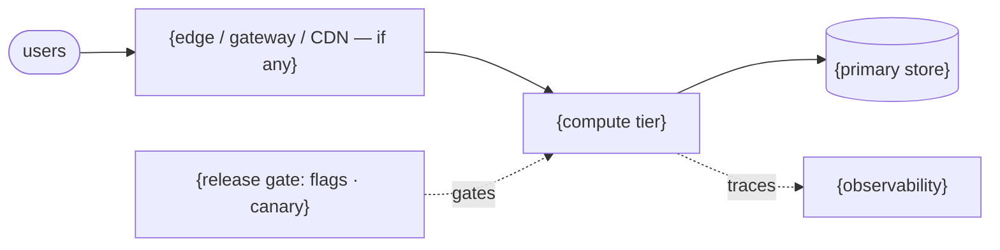

# Product Runtime Infrastructure — {Project name}

*Designs reflect the state of mid-2026. Tools and prices searched {date}. Re-validate before building; the field — and pricing — moves. Costs are calibrated estimates to expose the floor→ceiling delta, **not quotes**. This is a design for the **infrastructure the product *runs on*** in production — compute, data, delivery, and observability — not for the AI coding setup it was built *with* (that is the sibling skill `design-agentic-infrastructure`); "runtime" below always means the production topology.*

*Style contract — this report is a decision record, not a novel: one fact per bullet, two lines max; rationale is a single "why: …" clause, never argued prose; anything enumerable goes in a table with short cells; the recommended topology is drawn (≥ 1 mermaid diagram). A bullet that needs a third line is two facts — split it.*

## 1. The brief

- **Goal (one sentence):** {the product to run in production}
- **Requirements:** shape = {stateless / stateful / data-heavy / real-time / AI-featured} · traffic = {volume + spikiness} · latency SLO = {promise, or "none"}
- **Business stakes:** blast radius = {low / high — why: money / safety / compliance / data-loss} · lifespan = {throwaway / maintained}
- **Budget:** {number or "open"} · scaling regime = {usage-metered / provisioned / mixed — reserved baseline + metered burst}
- **Tech stack:** {brownfield: existing cloud/estate + residency/compliance to reuse | greenfield: hard constraints, or "none"} · agent-readiness = {agents consume/operate this: yes — surfaces apply / no — out of scope}
- **Cost inputs:** traffic = {req or jobs / period, peak vs avg} · compute/payload per request = {…} · data volume = {size + growth} · egress = {expectation} · inference = {volume if AI-featured, else "none"} · on-call = {model + rate}

> Mark every assumed value with ⚠ — especially anything the user didn't state (peak traffic, egress, data growth, on-call rate). Assumptions move the cost; flag them so they can be corrected.

## 2. Constraint translation

| The user brings… | Native reading | Cap it imposes (if any) |
|---|---|---|
| Requirements | shape {…} · traffic {…} · latency SLO {…} | {durable-state / SLO cap} |
| Business stakes | blast radius {…} · lifespan {…} | {backups + rollback gate + observability day-one} |
| Budget | cost arm + {regime} | {…} |
| Tech stack | boundaries {residency/on-prem} + platform fit + agent-readiness {…} | {residency cap, if any} |

**Binding caps (most-restrictive-wins):** {the ceilings every design must obey}
**Non-negotiables (hold for all three):** irreversible release behind a reversible gate · observability & SLOs day-one if maintained · durable state survives failure (backups + tested restore) · privileged/agent actions authorized-attributed-auditable.

## 3. The band, at a glance

| | Floor | Middle | Ceiling |
|---|---|---|---|
| **Runtime** (production topology) | {one managed tier + one store} | {+ what's added} | {+ what's added} |
| **Delivery** | {gate posture} | {gate posture} | {gate posture} |
| **Recovery** (RPO / RTO) | {e.g. ≤24 h / hours — restore from nightly backup} | {e.g. ≤1 h / minutes — PITR + replica} | {e.g. ~0 / seconds — multi-AZ failover} |
| **Climb trigger to reach it** | — start here (what *a-priori* evidence already justifies) | {*a-posteriori*: floor→middle — e.g. p99 breaches SLO} | {*a-posteriori*: middle→ceiling — e.g. region outage hurts SLO} |
| **Expected cost / period** | {$ range} | {$ range} | {$ range} |

> **Start at the floor.** The middle and ceiling are priced so you can see what "more" costs — not a recommendation to build them now. You climb only when the named evidence appears.

## 4. The three designs

### 🟢 Floor — {one-line identity}

*The lightest runtime the constraints permit — everything your a-priori evidence justifies, no more. Launch this.*

- **Runtime (production topology):** {one managed host / serverless} + {one store matched to the data's shape; see [`DATA-LAYER.md`](DATA-LAYER.md)}. Redundancy: {none / single-AZ — climb on proof}. Durability: {backups + tested restore if maintained; checkpointing if stateful}.
- **Delivery:** {push-to-deploy + rollback / flag / canary — the gate the blast radius demands; see [`RELEASE-GATES.md`](RELEASE-GATES.md)}. Post-deploy watch: {signals + rollback criteria, or "simple rollback — low blast radius"}.
- **Observability & SLOs:** {per-request traces + core SLOs from day-one if maintained; OTel / minimal; see [`OBSERVABILITY-SLO.md`](OBSERVABILITY-SLO.md)}.
- **Agent-ready surface:** {MCP-wrapped capabilities + agent identity if agents consume it; or "no agent consumers — out of scope"; see [`AGENT-READY.md`](AGENT-READY.md)}.
- **Tools (live, {date}):** {capability → tool}, … — landscape, not a ranking.
- **Caps honoured:** {tick each binding cap — show the floor still obeys them: rollback gate · backups · observability · identity}.
- **Cost / period:** {low / expected / high}. Drivers: {compute @ {price}, {date}} · {data tier} · {egress} · {on-call}. ⚠ {assumptions}.

**The floor, drawn** — redraw to match this design; every node must exist in it:

### 🟡 Middle — {one-line identity}

*The realistic next stop once the first a-posteriori evidence arrives.*

- **Climb trigger in:** {the named evidence — e.g. "p95 read latency breaches the SLO under load → add a cache tier"}.
- **Runtime / Delivery / Tools:** {the delta from the floor — what's added and why: a cache tier, a read replica, a tighter canary gate}.
- **Caps honoured:** {…}.
- **Cost / period:** {low / expected / high}. **Δ vs. floor:** {what the climb costs and which line item drives it}.

### 🔴 Ceiling — {one-line identity}

*The heaviest the constraints could ever justify. An upper bound, not a build-now plan.*

- **Entry condition:** {the proven scale / region-outage / write-saturation that would authorise this — and not before}.
- **Runtime / Delivery / Tools:** {e.g. multi-region active-active, dedicated data tier, durable-execution backbone; blue-green + shadow; full observability stack}.
- **Caps honoured:** {…, incl. tested cross-region failover}.
- **Cost / period:** {low / expected / high}. **Δ vs. floor:** {often large — the `redundancy_factor` (~2–3×+ for multi-region) + cross-region egress + on-call}.

### Availability & recovery — stated at every rung

*The failure axis is not a climb: escalation changes the **targets**, never whether recovery is designed. Every rung says what fails, what survives, and how fast it returns — floor included ("single-AZ, restore from last night's backup" is a valid floor answer; silence is not).*

| Durable state | Floor | Middle | Ceiling |
|---|---|---|---|
| {primary store} | RPO {…} · RTO {…} · {single-AZ + daily backups} | RPO {…} · RTO {…} · {+ PITR / replica} | RPO {…} · RTO {…} · {multi-AZ · tested failover} |
| {queue · files · cache-whose-loss-hurts} | {targets, or "loss acceptable — why"} | {…} | {…} |

- **Backup → restore, per store:** {method + schedule} → {the restore procedure: restored where, by whom, verified how} · **last tested:** {date, or "untested — a hope, not a backup" ([`DATA-LAYER.md`](DATA-LAYER.md))}.
- **Failure modes covered:** {instance dies · AZ down · bad deploy · data corruption / bad migration} → {which mechanism above answers each; an accepted risk (e.g. "region down: accepted at the floor") is stated, not silent}.

### Environment topology — the stage axis

*Which environments exist, and what substitutes for the ones that don't. "Production-only, verified behind flags" is a valid floor answer ([`RELEASE-GATES.md`](RELEASE-GATES.md) — ship dark, expose a slice); silence is not a topology.*

| | Floor | Middle | Ceiling |
|---|---|---|---|
| **Environments** | {e.g. local dev + production only} | {+ ephemeral preview / branch envs} | {+ staging at prod parity} |
| **Staging substitute** | {flags + canary slice / "none — accepted risk"} | {preview envs for pre-merge checks} | {— staging exists; parity gap noted} |
| **Promotion path** | {local → main → prod behind flag} | {… → preview → prod} | {… → staging → prod} |

- **Parity & drift:** {what each non-prod env differs from prod in (data, scale, config) and why the gap is acceptable; IaC keeping envs reproducible, or "hand-built — drift risk stated"}.
- **Non-prod data:** {seeded · synthetic · masked copy — and the residency/compliance cap if prod data is copied down}.

## 5. The cost ladder

| Line item | Floor | Middle | Ceiling |
|---|---|---|---|
| Compute / hosting | {$} | {$} | {$} |
| Data tier (instance/ops + storage + backups) | {$} | {$} | {$} |
| Egress / CDN | {$} | {$} | {$} |
| Managed-service fees (gateway · queue · durable-exec · observability) | {$} | {$} | {$} |
| Inference (if AI-featured) | {$} | {$} | {$} |
| Non-prod environments (preview · staging) | {$ / explicit €0} | {$} | {$} |
| On-call / ops time | {$} | {$} | {$} |
| Setup & maintenance (amortized) | {$} | {$} | {$} |
| **Total / period** | **{$ range}** | **{$ range}** | **{$ range}** |

**What drives the delta:** {the 2–3 line items — usually redundancy + egress + on-call}. **Sensitivity:** {the input that most moves the total — usually peak traffic × redundancy_factor}.
**The wants-vs-needs question:** the jump from {floor} to {ceiling} costs {Δ} for {what it buys — availability, reach, headroom}. Is that a **need**, or **nice to have**? Only evidence that the floor is failing (error budget burning, SLO breached) justifies paying it.

## 6. Recommendation

- **Start here:** the **Floor** — {restate it in one line}. It is what your constraints (a-priori evidence) already justify, and it satisfies every binding cap at the lowest cost.
- **First climb trigger to watch:** {the specific *a-posteriori* evidence that would move you to the middle, and where it surfaces — an SLO breach, error-budget burn, a cost-per-request crossover}.
- **Headroom & lead time:** {what saturates first at the floor — the connection pool, the single writer, instance CPU — and how much demand growth that headroom absorbs}. Demand growth inside the headroom is watched, not climbed on; the trigger is **capacity/SLO evidence** ([`MATRIX.md`](MATRIX.md) § climb triggers).
- **The climb, sequenced:** {floor→middle as ordered moves — e.g. cache the hot path first, then the replica; the data-migration step; rough lead time}. {If the lead time exceeds the warning the trigger gives, name the leading indicator the climb starts on instead.}

**When a trigger fires, start looking at** — the designs above name *capabilities* at the middle and ceiling; this table names *candidates*, pulled from the dated live search (§ 8). A shortlist that opens the evaluation, not a pre-decision: the climb still needs its evidence, and the search is re-run at climb time.

| Climb trigger | Capability it calls for | Candidates to evaluate first ({date}) |
|---|---|---|
| {e.g. p95 read latency breaches SLO} | {cache tier} | {2–3 names from the live search} |
| {e.g. single-writer saturation} | {read replica · dedicated data tier} | {…} |

- **De-escalation:** {a tier to remove if the SLO shows it never earns its cost — the arrow runs both ways: a near-idle replica, an over-provisioned box}.
- **Instantiate with:** {a skill from the instantiation registry that scaffolds this design — whole, or named liftable parts — with its install line; or "nothing on the shelf — hand-build."} **Not covered by it:** {what the skill leaves to you} . *(A proposal — design → instantiate is a human-gated two-step; nothing is invoked for you.)*
- **Designing the *build* plane too?** This skill designs the product runtime only. To design the AI coding setup that builds it — and to reconcile the shared substrate (durable execution, datastores, observability, flags, identity) across both — see the sibling `design-agentic-infrastructure` and the full-stack bridge that composes the two planes.
- **Next step:** stand up the floor, instrument it (traces + SLOs) so the climb triggers are observable, and move up only when the named evidence appears.

## 7. Faith & false-confidence check

- [ ] **Evidence-Gated Escalation kept** — the floor is justified by *a-priori* evidence (constraints) and nothing heavier; every climb above it names the *a-posteriori* evidence that authorises it; the output is a band, not a single point.
- [ ] **Caps honoured on all three designs**, floor included (rollback gate · backups + tested restore · observability day-one · identity/policy where stakes demand).
- [ ] **Recovery stated, not implied** — every durable store carries RPO/RTO at each rung and a named, **tested** restore path; accepted risks are written down, never silent.
- [ ] **Environment decision stated** — the stage axis names its environments, the staging substitute, and the promotion path; non-prod cost is priced or explicitly zero, never absent.
- [ ] **The climb is a path, not a leap** — the floor→middle transition is sequenced with a lead time; demand growth and capacity saturation stay distinct (growth inside headroom is watched, not climbed on).
- [ ] **Cost is a dated range, not a quote** — live prices, date stamped, assumptions flagged.
- [ ] **Sources listed** — § 8 carries the live URLs behind the tools and prices, so the reader can re-validate.
- [ ] **No registry candidate dismissed silently** — every `TOOLS-REGISTRY.md` candidate in a designed category has its disposition row in § 8, with the one-line why.
- [ ] **Style contract kept** — no bullet or table cell exceeds two lines; rationale rides as *why:* clauses; the recommended topology is drawn.
- [ ] No **green health check** standing in for health (looks like health, isn't — measure the user path + SLO).
- [ ] No **managed platform** standing in for scalability (looks like headroom; the bottleneck is the query / single writer, not the box).
- [ ] No **successful deploy** standing in for a successful release (looks like done; the release isn't watched or reversible).

## 8. Sources (searched {date})

The live web-search sources behind the tool landscape and the prices used above — grouped by capability/topic, with each source as a markdown link. Re-validate before building; pricing and product pages move fast. Plain-text entries are sources without a stable public link (e.g. a spec version read directly).

- {capability or topic} — [{label}]({url}) · [{label}]({url})
- {capability or topic} — [{label}]({url}) · {OpenTelemetry spec (vX.YZ)}
- …

**Registry disposition** — [`TOOLS-REGISTRY.md`](TOOLS-REGISTRY.md) seeded the search (a dated mid-2026 snapshot); every candidate in a category this design covers gets a verdict — losing to the live search is fine, vanishing is not. Categories the design doesn't touch need no row.

| Category | Registry candidate(s) | Verdict | Why (one line) |
|---|---|---|---|
| {capability} | {names} | {adopted · priced-and-lost-to-{X} · wrong-shape · not-pinnable} | {e.g. "managed tier ≈ €{n}/mo lost to €0 self-hosted at floor volume"} |
| … | … | … | … |
